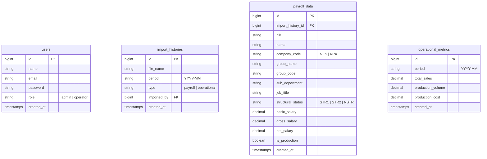

# Arsitektur MVP - Dashboard Penggajian Industri

## 1. Stack Teknologi
Aplikasi menggunakan stack modern monolitik yang efisien:
* **Backend**: Laravel 13 (PHP ^8.3)
* **Frontend**: Vue 3 (Composition API) via Inertia.js (tanpa API terpisah, routing menyatu)
* **Styling**: Tailwind CSS v4 (menggunakan `@tailwindcss/vite` untuk integrasi cepat)
* **Database**: SQLite (cepat untuk pengembangan lokal dan MVP)
* **Excel Processor**: `phpoffice/phpspreadsheet`
* **Charts**: Chart.js (`lucide-vue-next` untuk ikon)

## 2. Skema Database (Desain Relasional)

### Penjelasan Tabel Utama
1. **`import_histories`**: Mencatat log setiap kali admin mengimpor data payroll atau metrik operasional.
2. **`payroll_data`**: Menyimpan data payroll tingkat individu hasil parsing file Excel. Kunci analisis terletak pada klasifikasi `structural_status` dan `is_production`.
3. **`operational_metrics`**: Menyimpan agregasi bulanan kinerja operasional perusahaan untuk disandingkan dengan biaya total payroll pada periode terkait.

## 3. Klasifikasi Manpower (Kunci Bisnis)
Aplikasi membagi biaya manpower berdasarkan dua sumbu penting:
1. **Fungsi Kerja (`is_production`)**:
   * **Production**: Karyawan di departemen Pabrikasi, Elektrikal, Logistik Pabrik, dll. (terlibat langsung dalam proses fisik produk).
   * **Non-Production**: Karyawan di departemen Finance, HRD, IT, Marketing, dll. (fungsi pendukung bisnis).
2. **Tingkat Struktural (`structural_status`)**:
   * **STR1 (Struktural 1)**: Tingkat manajemen menengah-tinggi (Kepala Departemen / Kadept, Manager).
   * **STR2 (Struktural 2)**: Tingkat manajemen lini pertama (Kepala Bagian / Kabag, Kepala Regu / Karu, Project Manager).
   * **NSTR (Non-Struktural)**: Karyawan pelaksana (Operator, Welder, Teknisi, Driver, dll.).

